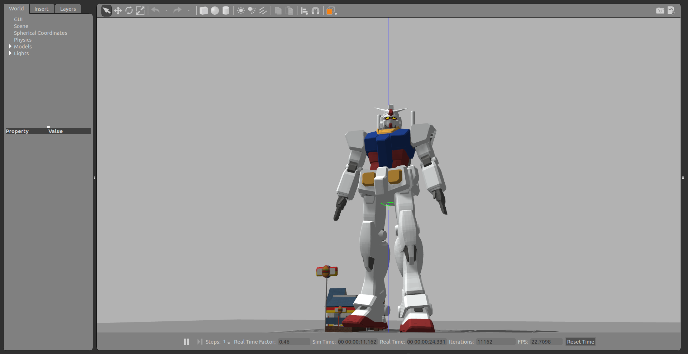

gundam_robot [](https://travis-ci.com/gundam-global-challenge/gundam_robot)
========================================================================================================================================================================
Paquetes ROS para robots GUNDAM



Experimental
------------

Puede ejecutar el patrón de caminar "Robot" en la simulación

```
$ roslaunch gundam_rx78_gazebo gundam_rx78_walk.launch
```

Puede ejecutar el control del robot

```
$ roslaunch gundam_rx78_gazebo gundam_rx78_control.launch
```

Otras pruebas

```
# step
$ rosrun gundam_rx78_control joint_trajectory_client_csv.py `rospack find gundam_rx78_control`/sample/csv/step.csv
# walk forward
$ rosrun gundam_rx78_control joint_trajectory_client_csv.py `rospack find gundam_rx78_control`/sample/csv/walk-forward.csv
# walk backward
$ rosrun gundam_rx78_control joint_trajectory_client_csv.py `rospack find gundam_rx78_control`/sample/csv/walk-backward.csv
# walk to right
$ rosrun gundam_rx78_control joint_trajectory_client_csv.py `rospack find gundam_rx78_control`/sample/csv/walk-to-right.csv
# walk to left
$ rosrun gundam_rx78_control joint_trajectory_client_csv.py `rospack find gundam_rx78_control`/sample/csv/walk-to-left.csv
# turn right
$ rosrun gundam_rx78_control joint_trajectory_client_csv.py `rospack find gundam_rx78_control`/sample/csv/turn-right.csv
# turn left
$ rosrun gundam_rx78_control joint_trajectory_client_csv.py `rospack find gundam_rx78_control`/sample/csv/turn-left.csv
```

